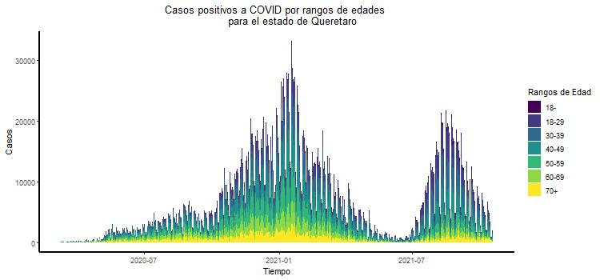
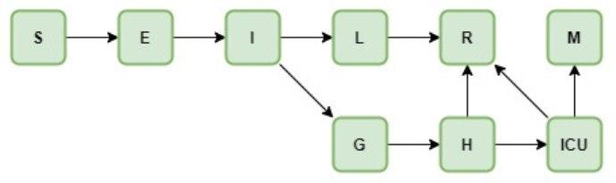
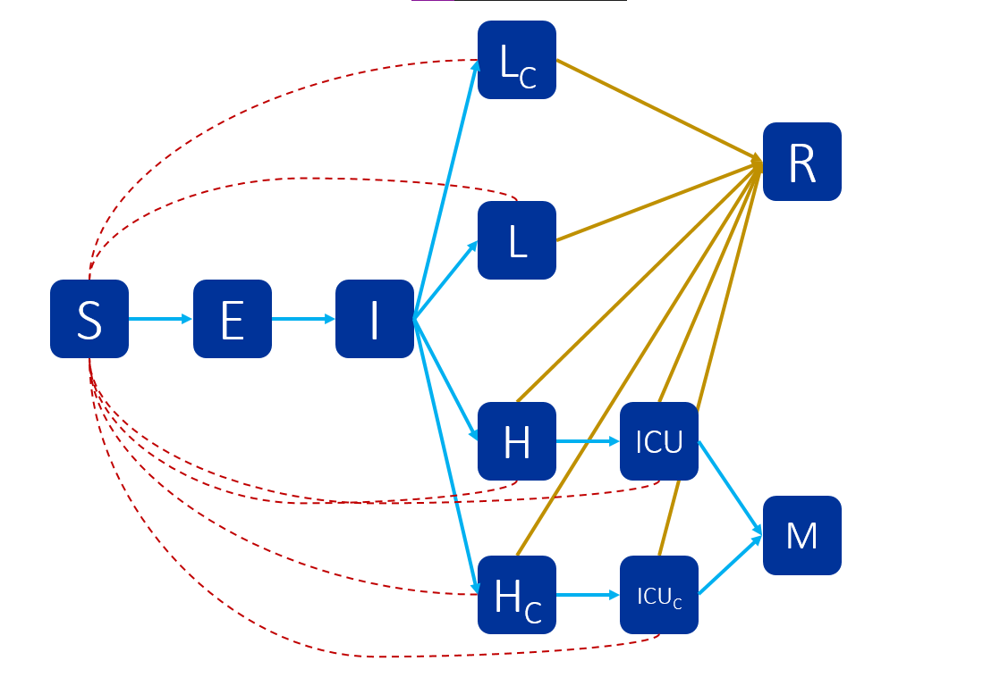
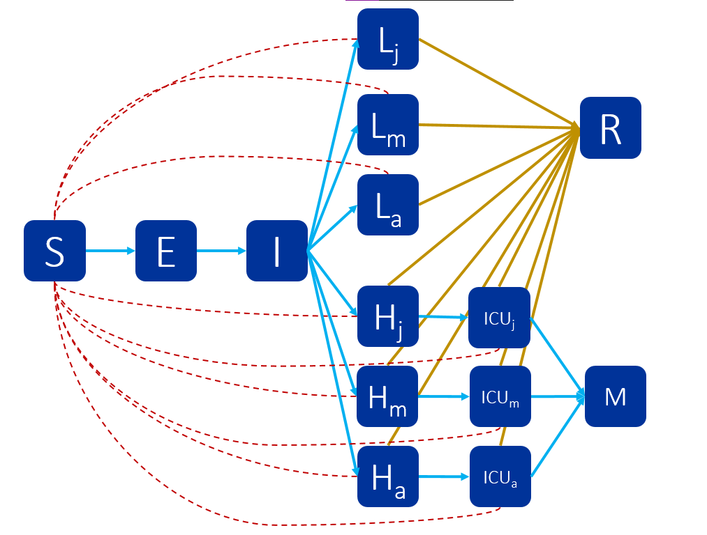

```{r}
library(deSolve)
```

# Gráfica de casos positivos por rangos de edad



# Modelo epidemiológico para COVID-19 de la CDMX

Para la construcción de este modelo, se tomo como base el [modelo
epidemiológico para COVID-19 en la
CDMX](https://modelo.covid19.cdmx.gob.mx/modelo-epidemico)

## Diagrama de Compartimentos



## Variables

-   **S** : suceptibles
-   **E** : expuestos
-   **I** : infectados
-   **L** : contagiados sintomáticos leves
-   **G** : contagiados sintomáticos graves
-   **H** : hospitalizados
-   **ICU** : unidad de terapia intensiva
-   **R** : recuperados
-   **M** : muertos

## Ecuaciones


$$\begin{array}{l}

\dot S = - ( \frac { R_0 }{ D_{infect} } ) I S \\

\dot E = ( \frac { R_0 }{ D_{infect} } ) I S - ( \frac { 1 }{ D_{incub} } ) E \\

\dot I = ( \frac { 1 }{ D_{incub} } ) E - ( \frac { 1 }{ D_{infect} } ) I \\

\dot L = ( 1 - p_{grave} ) ( \frac { 1 }{ D_{infect} } ) I - ( \frac { 1 }{ D_{RL} } ) L \\

\dot G = p_{grave} ( \frac { 1 }{ D_{infect} } ) I - ( \frac { 1 }{ D_{hosp} } ) G \\

\dot H = ( \frac { 1 }{ D_{hosp} } ) G - ( 1 - p_{ICU} ) ( \frac { 1 }{ D_{RH} } ) H - p_{ICU} ( \frac { 1 }{ D_{ICU} } ) H \\

\dot {ICU} = p_{ICU} ( \frac { 1 }{ D_{ICU} } ) H - ( 1 - p_{M} )( \frac { 1 }{ D_{RICU} } ) ICU - p_M ( \frac { 1 }{ D_M } ) ICU \\

\dot R = ( \frac { 1 }{ D_{RL} } ) L + ( 1 - p_{ICU} ) ( \frac { 1 }{ D_{RH} } ) H + ( 1 - p_{M} )( \frac { 1 }{ D_{RICU} } ) ICU \\

\dot M = p_M ( \frac { 1 }{ D_M } ) ICU

\end{array}$$

## Valor de los parámetros

+-----------------------------+--------+-----------------------------+
| Variable                    | Valor  | Fuente                      |
+=============================+========+=============================+
| Multiplicador por           | 2      |                             |
| subreporte                  |        |                             |
+-----------------------------+--------+-----------------------------+
| Tiempo que es infeccioso el | 2.9    | Kucharski et. al. (2020)    |
| paciente \                  |        |                             |
| *D~infect~*                 |        |                             |
+-----------------------------+--------+-----------------------------+
| Tiempo de incubación        | 5.2    | Li et. al.  (2020)          |
| (días) \                    |        |                             |
| *D~incub~*                  |        |                             |
+-----------------------------+--------+-----------------------------+
| Tasa de hospitalización \   | 13.80% | Phua et.al (2020).          |
| *p ~grave~*                 |        |                             |
+-----------------------------+--------+-----------------------------+
| Tiempo de recuperación de   | 14     | WHO (2020a)                 |
| casos leves (días) \        |        |                             |
| *D~RL~*                     |        |                             |
+-----------------------------+--------+-----------------------------+
| Tiempo entre presencia de   | 4      | Heiden y Buchholz (2020)    |
| síntomas y hospitalización  |        |                             |
| en casos graves (días)\     |        |                             |
| *D ~hosp~*                  |        |                             |
+-----------------------------+--------+-----------------------------+
| Tasa de UCI \               | 5%     | Guan et.al. (2020)          |
| *p ~ICU~*                   |        |                             |
+-----------------------------+--------+-----------------------------+
| Tiempo entre                | 12     | Zhou et.al. (2020)          |
| hospitalización de casos    |        |                             |
| graves no UCI y             |        |                             |
| recuperación (días)\        |        |                             |
| *D ~RH~*                    |        |                             |
+-----------------------------+--------+-----------------------------+
| Tasa de letalidad respecto  | 3%     | Wang et. al. (2020)         |
| a población general\        |        |                             |
| *p ~M~*                     |        |                             |
+-----------------------------+--------+-----------------------------+
| Tiempo entre                | 1      | Heiden y Buchholz (2020)    |
| hospitalización de casos    |        |                             |
| graves e ingreso a UCI      |        |                             |
| (días) \                    |        |                             |
| *D~ICU~*                    |        |                             |
+-----------------------------+--------+-----------------------------+
| Tiempo entre ingreso a UCI  | 7      | Zhou et.al. (2020)          |
| y recuperación (días) \     |        |                             |
| *D~RICU~*                   |        |                             |
+-----------------------------+--------+-----------------------------+
| Tiempo entre ingreso a UCI  | 8      | Zhou et.al. (2020)          |
| y deceso (días) \           |        |                             |
| *D~M~*                      |        |                             |
+-----------------------------+--------+-----------------------------+
| Población susceptible       | 22     | CONAPO (2019)               |
| (millones)\                 |        |                             |
| *N*                         |        |                             |
+-----------------------------+--------+-----------------------------+
| \                           | 2.83   | Inferido, pero consistente  |
| *R~0~*                      |        | con Leung M. & Leung G.     |
|                             |        | (2020)                      |
+-----------------------------+--------+-----------------------------+

## Resolución numérica del modelo de CDMX


```{r}

covis <- function (t, state, parameters){
  with(as.list(c(state, parameters)), {
    
    dS   <- -(R0/Dinfect)*I*S
    dE   <- (R0/Dinfect)*I*S - (1/Dincub)*E
    dI   <- (1/Dincub)*E - (1/Dinfect)*I
    dL   <- (1-pGrave)*(1/Dinfect)*I - (1/DRL)*L
    dG   <- pGrave*(1/Dinfect)*I - (1/Dhosp)*G
    dH   <- (1/Dhosp)*G - (1-pICU)*(1/DRH)*H - pICU*(1/DICU)*H
    dICU <- pICU*(1/DICU)*H - (1-pM)*(1/DRICU)*ICU - pM*(1/DM)*ICU
    dR   <- (1/DRL)*L + (1-pICU)*(1/DRH)*H + (1-pM)*(1/DRICU)*ICU
    dM   <- pM*(1/DM)*ICU
    
    list(c(dS, dE, dI, dL, dG, dH, dICU, dR, dM))
    
  })
}

parameters <- c(
  
  Dinfect <- 2.9, 
  Dincub  <- 5.2,
  pGrave  <- 0.138,
  DRL     <- 14,
  Dhosp   <- 4,
  pICU    <- 0.05,
  DRH     <- 12,
  pM      <- 0.03,
  DICU    <- 1,
  DRICU   <- 7,
  DM      <- 8,
  R0      <- 2.83,
  N       <- 22000000
  
)


state <- c(S   = N - 1 ,
           E   = 0     ,
           I   = 1     ,
           L   = 0     ,
           G   = 0     ,
           H   = 0     ,
           ICU = 0     ,
           R   = 0     ,
           M   = 0     )


t  <- seq(0, 100, by = 0.001)


out <- ode(state, t, covis, parameters)

matplot(out[,1], out[,2:10], type ="l", xlab = "tiempo", ylab = "Población", main = "Modelo COVID de CDMX", lwd = 2, lty = 1)
legend("topright", c("Suceptibles"                     , 
                     "Expuestos"                       , 
                     "Infectados"                      ,
                     "Contagiados sintomáticos leves"  ,
                     "Contagiados sintomáticos graves" , 
                     "Hospitalizados"                  ,
                     "Unidad de Terapia Intensiva"     ,
                     "Recuperados"                     ,
                     "Muertos")
       , col = 1:9, lty = 1, cex = 0.5)

```


# Modelo Heterogéneo

## Determinación de parámetros

-   Probabilidad de hospitalización -> **Tasa de Hospitalización**

-   Probabilidad de entrar a la Unidad de Cuidados Intensivos
    (Intubados) -> **Tasa de UCI**

-   Probabilidad de morir -> **Tasa de letalidad**

    <p>

    </p>

-   **Con** y **Sin** conmorbilidades\
    \
    **Datos al 19 de Octubre de 2021**

    <p>

    </p>
    
    
### Probabilidades separadas por grupo de edad y conmorbilidades

+---------+-------------------+-------------------+-----------------+-----------------+-----------------+-----------------+
| Grupos  | Hospitalizado con | Hospitalizado sin | Intubados con   | Intubados sin   | Muerte con      | Muerte sin      |
| de edad | conmorbilidades   | conmorbilidades   | conmorbilidades | conmorbilidades | conmorbilidades | conmorbilidades |
+=========+===================+===================+=================+=================+=================+=================+
| p18-    | 0.01943509        | 0.09779180        | 0.012618297     | 0.001554807     | 0.02208202      | 0.0007774035    |
+---------+-------------------+-------------------+-----------------+-----------------+-----------------+-----------------+
| p18-29  | 0.01735169        | 0.04831933        | 0.005882353     | 0.001211710     | 0.01323529      | 0.0020841411    |
+---------+-------------------+-------------------+-----------------+-----------------+-----------------+-----------------+
| p30-39  | 0.03833700        | 0.10143730        | 0.015033868     | 0.004568058     | 0.02825045      | 0.0087313519    |
+---------+-------------------+-------------------+-----------------+-----------------+-----------------+-----------------+
| p40-49  | 0.07172753        | 0.17840024        | 0.033253445     | 0.012064013     | 0.07159976      | 0.0217480509    |
+---------+-------------------+-------------------+-----------------+-----------------+-----------------+-----------------+
| p50-59  | 0.13165567        | 0.28438900        | 0.056301983     | 0.026085622     | 0.13339731      | 0.0540125825    |
+---------+-------------------+-------------------+-----------------+-----------------+-----------------+-----------------+
| p60-69  | 0.24829932        | 0.42719086        | 0.100153745     | 0.061980348     | 0.25763233      | 0.1489040060    |
+---------+-------------------+-------------------+-----------------+-----------------+-----------------+-----------------+
| p70+    | 0.42984257        | 0.56591640        | 0.102601578     | 0.086242300     | 0.37854429      | 0.2908966461    |
+---------+-------------------+-------------------+-----------------+-----------------+-----------------+-----------------+
| general | 0.2411651         | 0.06367464        | 0.04695305      | 0.0111001       | 0.1255307       | 0.02528099      |
+---------+-------------------+-------------------+-----------------+-----------------+-----------------+-----------------+

### Probabilidades por grupo de edad

+---------+-------------------+-------------------+-----------------+
| Grupos  | Hospitalizado     | Intubados         | Muerte          |
| de edad |                   |                   |                 |
+=========+===================+===================+=================+
| p18-    | 0.02534672        | 0.002391200       | 0.002391200     |
+---------+-------------------+-------------------+-----------------+
| p18-29  | 0.02313048        | 0.002084890       | 0.004169781     | 
+---------+-------------------+-------------------+-----------------+
| p30-39  | 0.05470488        | 0.007271172       | 0.013815227     |
+---------+-------------------+-------------------+-----------------+
| p40-49  | 0.10946855        | 0.019551741       | 0.039421396     | 
+---------+-------------------+-------------------+-----------------+
| p50-59  | 0.20635417        | 0.040848267       | 0.092886767     | 
+---------+-------------------+-------------------+-----------------+
| p60-69  | 0.36123837        | 0.086075246       | 0.217548244     |
+---------+-------------------+-------------------+-----------------+
| p70+    | 0.52535787        | 0.097546012       | 0.352147239     | 
+---------+-------------------+-------------------+-----------------+


## Definición de grupos 

-   **S**           : suceptibles
-   **E**           : expuestos
-   **I**           : infectados
-   **L** = $I_l$   : contagiados sintomáticos leves
-   **H** = $I_h$   : hospitalizados heterogeneos 
-   **ICU** = $I_i$ : intubados heterogeneos
-   **R**           : recuperados
-   **M**           : muertos heterogeneos
<p>&nbsp;</p>
  + Presencia de conmorbilidades
  + Edades
    + Grupo 2: jóvenes, adultos jóvenes (18-, 18-29, 30-39)
    + Grupo 3: adultos de mediana edad (40-49, 50-59)
    + Grupo 4: adultos mayores (60-69, 70+)

## Supuestos generales

-   No considera demografía
-   Hay 8 variables que cambian con respecto al tiempo
-   La infección se da por las interacciones:
    -   Suceptible - Infectado
    -   Suceptible - Infectado sintomático leve
    -   Suceptible - Infectado sintomático hospitalizado
    -   Suceptible - Infectado sintomático intubado en Unidad de
        Cuidados Intensivos
-   La tasa de infección es la misma en cada interacción de los
    suceptible
-   Los infectados pueden recuperarse

## Modelo Heterogeneo por conmorbilidades

### Diagrama por compartimentos



### Supuestos para el modelo de conmorbilidades

+ Las tasas de recuperación de infectados leves, hospitalizados e intubados;  hospitalización, individuos en UCI e infectados sintomáticos leves, son las mismas para individuos con conmorbilidades que para los que no las tienen.

+ Lo que varía es la tasa de hospitalizaciones, intubacion y decesos.

### Variables del modelo 

- **S** : suceptibles
- **E** : expuestos
- **I** : infectados
- **$L_C$** : infectados sintomáticos leves con conmorbilidades
- **$L$** : infectados sintomáticos leves sin conmorbilidades
- **$H_C$** : hospitalizados con conmorbilidades
- **$H$** : hospitalizados sin conmorbilidades
- **$ICU_C$** : intubados con conmorbilidades
- **$ICU$** : intubados sin conmorbilidades
- **M** : muertos 
- **R** : recuperados

### Parámetros del modelo 

+-----------------------------+--------+
| Variable                    | Valor  |
+=============================+========+
| Multiplicador por           | 2      |                             
| subreporte                  |        |                             
+-----------------------------+--------+
| Tiempo que es infeccioso el | 2.9    | 
| paciente \                  |        |                             
| *D~infect~*                 |        |                             
+-----------------------------+--------+
| Tiempo de incubación        | 5.2    |          
| (días) \                    |        |                             
| *D~incub~*                  |        |                             
+-----------------------------+--------+
| Tasa de hospitalización     |        |
| sin conmorbilidades     \   | 0.06   |       
| *p ~hops~*                  |        |                             
+-----------------------------+--------+
| Tasa de hospitalización     |        |
| con conmorbilidades     \   | 0.24   |       
| *p ~hospconm~*              |        |                             
+-----------------------------+--------+
| Tiempo de recuperación de   | 14     |
| casos leves (días) \        |        |                             
| *D~RL~*                     |        |                             
+-----------------------------+--------+
| Tiempo entre presencia de   | 4      |
| síntomas y hospitalización  |        |                             
| en casos graves (días)\     |        |                             
| *D ~hosp~*                  |        |                             
+-----------------------------+--------+
| Tasa de UCI sin             |        |
| conmorbilidades \           |  0.01  |
| *p ~ICU~*                   |        |                             
+-----------------------------+--------+
| Tasa de UCI con             |        |
| conmorbilidades \           |  0.04  |
| *p ~ICUconm~*               |        |                             
+-----------------------------+--------+
| Tiempo entre                | 12     | 
| hospitalización de casos    |        |                             
| graves no UCI y             |        |                            
| recuperación (días)\        |        |                             
| *D ~RH~*                    |        |                             
+-----------------------------+--------+
| Tasa de letalidad respecto  |        |         
| a población sin             |   0.02 |
| conmorbilidades \           |        |                             
| *p ~M~*                     |        |                             
+-----------------------------+--------+
| Tasa de letalidad respecto  |        |         
| a población con             |   0.12 |
| conmorbilidades \           |        |                             
| *p ~Mconm~*                 |        |                             
+-----------------------------+--------+
| Tiempo entre                | 1      |
| hospitalización de casos    |        |                             
| graves e ingreso a UCI      |        |                             
| (días) \                    |        |                             
| *D~ICU~*                    |        |                             
+-----------------------------+--------+
| Tiempo entre ingreso a UCI  | 7      |
| y recuperación (días) \     |        |                             
| *D~RICU~*                   |        |                             
+-----------------------------+--------+
| Tiempo entre ingreso a UCI  | 8      |
| y deceso (días) \           |        |                             
| *D~M~*                      |        |                             
+-----------------------------+--------+
| Población susceptible       | 22     |
| (millones)\                 |        |                             
| *N*                         |        |                             
+-----------------------------+--------+
| \                           | 2.83   |
| *R~0~*                      |        |   
|                             |        |                       
+-----------------------------+--------+


### Ecuaciones del modelo 

$$\begin{array}{l}

\dot S = - ( \frac { R_0 }{ D_{infect} } ) S(I_{LC} + I_L + I_H + I_{HC} + I_I + I_{IC} ) \\

\dot E = ( \frac { R_0 }{ D_{infect} } ) S(I_{LC} + I_L + I_H + I_{HC} + I_I + I_{IC} ) - ( \frac { 1 }{ D_{incub} } ) E \\

\dot I = ( \frac { 1 }{ D_{incub} } ) E - 
( 1 - p_{hosp} )( \frac { 1 }{ D_{infect} } ) I -
( 1 - p_{hospconm} )( \frac { 1 }{ D_{infect} } ) I -
p_{hosp}( \frac { 1 }{ D_{infect} } ) I -
p_{hospconm}( \frac { 1 }{ D_{infect} } ) I\\

\dot L = ( 1 - p_{hosp} )( \frac { 1 }{ D_{infect} } ) I 
- ( \frac { 1 }{ D_{RL} } ) L \\

\dot L_C = ( 1 - p_{hospconm} )( \frac { 1 }{ D_{infect} } ) I 
- ( \frac { 1 }{ D_{RL} } ) L_C \\

\dot H = p_{hosp}( \frac { 1 }{ D_{infect} } ) I 
- ( 1 - p_{ICU} ) ( \frac { 1 }{ D_{RH} } ) H 
- p_{ICU} ( \frac { 1 }{ D_{ICU} } ) H \\

\dot H_C = p_{hospconm}( \frac { 1 }{ D_{infect} } ) I 
- ( 1 - p_{ICUconm} ) ( \frac { 1 }{ D_{RH} } ) H_C 
- p_{ICUconm} ( \frac { 1 }{ D_{ICU} } ) H_C \\ 

\dot {ICU} = p_{ICU} ( \frac { 1 }{ D_{ICU} } ) H 
- ( 1 - p_M )( \frac { 1 }{ D_{RICU} } ) ICU 
- p_M ( \frac { 1 }{ D_M } ) ICU \\

\dot {ICU_C} = p_{ICUconm} ( \frac { 1 }{ D_{ICU} } ) H_C 
- ( 1 - p_{Mconm} )( \frac { 1 }{ D_{RICU} } ) ICU_C 
- p_{Mconm} ( \frac { 1 }{ D_M } ) ICU_C \\

\dot R =  ( \frac { 1 }{ D_{RL} } ) L + ( \frac { 1 }{ D_{RL} } ) L_C
+ ( 1 - p_{ICU} ) ( \frac { 1 }{ D_{RH} } ) H  
+ ( 1 - p_{ICUconm} ) ( \frac { 1 }{ D_{RH} } ) H_C 
+ ( 1 - p_M )( \frac { 1 }{ D_{RICU} } ) ICU 
+ ( 1 - p_{Mconm} )( \frac { 1 }{ D_{RICU} } ) ICU_C \\

\dot M = p_M ( \frac { 1 }{ D_M } ) ICU 
+ p_{Mconm} ( \frac { 1 }{ D_M } ) ICU_C\\

\end{array}$$

### Resolución numérica del modelo


```{r}

covis_conm <- function (t, state, parameters){
  with(as.list(c(state, parameters)), {
    
    dS   <- -(R0/Dinfect)*S*(LC + L + H + HC + ICU + ICUC)
    dE   <- (R0/Dinfect)*S*(LC + L + H + HC + ICU + ICUC) - (1/Dincub)*E
    dI   <- (1/Dincub)*E - (1-phosp)*(1/Dinfect)*I - (1-phospconm)*(1/Dinfect)*I 
    - phosp*(1/Dinfect)*I - phospconm*(1/Dinfect)*I
    dL   <- (1-phosp)*(1/Dinfect)*I - (1/DRL)*L
    dLC  <- (1-phospconm)*(1/Dinfect)*I - (1/DRL)*LC
    dH   <- phosp*(1/Dinfect)*I - (1-pICU)*(1/DRH)*H - pICU*(1/DICU)*H
    dHC  <- phospconm*(1/Dinfect)*I - (1-pICUconm)*(1/DRH)*HC 
    - pICUconm*(1/DICU)*HC
    dICU <- pICU*(1/DICU)*H - (1-pM)*(1/DRICU)*ICU - pM*(1/DM)*ICU
    dICUC<- pICUconm*(1/DICU)*HC - (1-pMconm)*(1/DRICU)*ICUC - pMconm*(1/DM)*ICUC
    dR   <- (1/DRL)*L + (1/DRL)*LC + (1-pICU)*(1/DRH)*H + (1-pICUconm)*(1/DRH)*HC 
    + (1-pM)*(1/DRICU)*ICU + (1-pMconm)*(1/DRICU)*ICUC
    dM   <- pM*(1/DM)*ICU + pMconm*(1/DM)*ICUC
    
    list(c(dS, dE, dI, dL, dLC, dH, dHC, dICU, dICUC, dR, dM))
    
  })
}

parameters <- c(
  
  Dinfect <- 2.9, 
  Dincub  <- 5.2,
  DRL     <- 14,
  Dhosp   <- 4,
  DRH     <- 12,
  phosp   <- 0.06,
  phospconm <- 0.24,
  pICUconm <- 0.04,
  pICU    <- 0.05,
  pM      <- 0.03,
  pMconm  <- 0.12,
  DICU    <- 1,
  DRICU   <- 7,
  DM      <- 8,
  R0      <- 2.83,
  N       <- 22000000
  
)


state <- c(S   = N - 1 ,
           E   = 0     ,
           I   = 1     ,
           LC = 0     ,
           L  = 0     ,
           H   = 0     ,
           HC = 0 ,
           ICU = 0     ,
           ICUC = 0 ,
           R   = 0     ,
           M   = 0     )


t  <- seq(0, 100, by = 0.001)


out <- ode(state, t, covis_conm, parameters)

matplot(out[,1], out[,2:10], type ="l", xlab = "tiempo", ylab = "Población", main = "Modelo Heterogeneo por presencia de conmorbilidad de COVID", lwd = 2, lty = 1)
legend("topright", c("Suceptibles"                     , 
                     "Expuestos"                       , 
                     "Infectados"                      ,
                     "Contagiados sintomáticos leves sin conmorbilidades",
                     "Contagiados sintomáticos leves con conmorbilidades",
                     "Hospitalizados sin conmorbilidades"                  ,
                     "Hospitalizados con conmorbilidades" ,
                     "Unidad de Terapia Intensiva sin conmorbilidades"     ,
                     "Unidad de Terapia Intensiva con conmorbilidades" ,
                     "Recuperados"                     ,
                     "Muertos")
       , col = 1:11, lty = 1, cex = 0.5)
```

## Modelo Heterogeneo por estructura de edad

### Diagrama por compartimentos



## Supuestos del modelo

+ Las tasas de recuperación de infectados leves, hospitalizados e intubados; hospitalización, individuos en UCI e infectados sintomáticos leves, son las mismas para individuos de diferentes edades.

+ Lo que varía es la tasa de hospitalizaciones, intubacion y decesos.

## Variables del Modelo

- **S** : suceptibles
- **E** : expuestos
- **I** : infectados
- **$L_j$** : infectados sintomáticos leves de individuos menores de 18 años hasta 39
- **$L_m$** : infectados sintomáticos leves de individuos de 40 a 59 años
- **$L_a$** : infectados sintomáticos leves de individuos de 60 a más de 70 años
- **$H_j$** : hospitalizados de individuos menores de 18 años hasta 39
- **$H_m$** : hospitalizados de individuos de 40 a 59 años
- **$H_a$** : hospitalizados de individuos de individuos de 60 a más de 70 años
- **$ICU_j$** : intubados de individuos menores de 18 años hasta 39
- **$ICU_m$** : intubados de individuos de 40 a 59 años
- **$ICU_a$** : intubados de individuos de individuos de 60 a más de 70 años
- **M** : muertos 
- **R** : recuperados

## Parámetros del modelo

+-----------------------------+--------+
| Variable                    | Valor  |
+=============================+========+
| Multiplicador por           | 2      |                             
| subreporte                  |        |                             
+-----------------------------+--------+
| Tiempo que es infeccioso el | 2.9    | 
| paciente \                  |        |                             
| *D~infect~*                 |        |                             
+-----------------------------+--------+
| Tiempo de incubación        | 5.2    |          
| (días) \                    |        |                             
| *D~incub~*                  |        |                             
+-----------------------------+--------+
| Tasa de hospitalización     |        |
| en menores de 39 años    \  | 0.1    |       
| *p ~hops~*                  |        |                             
+-----------------------------+--------+
| Tasa de hospitalización     |        |
| de 40 a 59 años         \   | 0.31   |       
| *p ~hospconm~*              |        |                             
+-----------------------------+--------+
| Tasa de hospitalización     |        |
| de 60 y más de 70 años \    | 0.88   |       
| *p ~hospconm~*              |        |                             
+-----------------------------+--------+
| Tiempo de recuperación de   | 14     |
| casos leves (días) \        |        |                             
| *D~RL~*                     |        |                             
+-----------------------------+--------+
| Tiempo entre presencia de   | 4      |
| síntomas y hospitalización  |        |                             
| en casos graves (días)\     |        |                             
| *D ~hosp~*                  |        |                             
+-----------------------------+--------+
| Tasa de UCI en menores      |        |
| de 39 años \                |  0.01  |
| *p ~ICU~*                   |        |                             
+-----------------------------+--------+
| Tasa de UCI                 |        |
| de 40 a 59 años \           |  0.06  |
| *p ~ICU~*                   |        |                             
+-----------------------------+--------+
| Tasa de UCI                 |        |
| de 60 y más de 70 años \    |  0.18  |
| *p ~ICU~*                   |        |                             
+-----------------------------+--------+
| Tiempo entre                | 12     | 
| hospitalización de casos    |        |                             
| graves no UCI y             |        |                            
| recuperación (días)\        |        |                             
| *D ~RH~*                    |        |                             
+-----------------------------+--------+
| Tasa de letalidad           |        |         
| de la población             |   0.02 |
| en menores de 39 años \     |        |                             
| *p ~M~*                     |        |                             
+-----------------------------+--------+
| Tasa de letalidad           |        |         
| de la población             |   0.13 |
| de 40 a 59 años \           |        |                             
| *p ~M~*                     |        |                             
+-----------------------------+--------+
| Tasa de letalidad           |        |         
| de la población             |   0.56 |
| de 60 y más de 70 años \    |        |                             
| *p ~M~*                     |        |                             
+-----------------------------+--------+
| Tiempo entre                | 1      |
| hospitalización de casos    |        |                             
| graves e ingreso a UCI      |        |                             
| (días) \                    |        |                             
| *D~ICU~*                    |        |                             
+-----------------------------+--------+
| Tiempo entre ingreso a UCI  | 7      |
| y recuperación (días) \     |        |                             
| *D~RICU~*                   |        |                             
+-----------------------------+--------+
| Tiempo entre ingreso a UCI  | 8      |
| y deceso (días) \           |        |                             
| *D~M~*                      |        |                             
+-----------------------------+--------+
| Población susceptible       | 22     |
| (millones)\                 |        |                             
| *N*                         |        |                             
+-----------------------------+--------+
| \                           | 2.83   |
| *R~0~*                      |        |   
|                             |        |                       
+-----------------------------+--------+

## Ecuaciones del modelo 

$$\begin{array}{l}

\dot S = - ( \frac { R_0 }{ D_{infect} } ) S (L_j + L_m + L_a
+ H_j + H_m + H_a + ICU_j + ICU_m + ICU_a) \\

\dot E = ( \frac { R_0 }{ D_{infect} } ) S (L_j + L_m + L_a
+ H_j + H_m + H_a + ICU_j + ICU_m + ICU_a) - ( \frac { 1 }{ D_{incub} } ) E \\

\dot I = ( \frac { 1 }{ D_{incub} } ) E - 
(1 - p_{hosj} )( \frac { 1 }{ D_{infect} } ) I -
(1 - p_{hosm} )( \frac { 1 }{ D_{infect} } ) I -
(1 - p_{hosa} )( \frac { 1 }{ D_{infect} } ) I -
p_{hosj}( \frac { 1 }{ D_{infect} } ) I -
p_{hosm}( \frac { 1 }{ D_{infect} } ) I -
p_{hosa}( \frac { 1 }{ D_{infect} } ) I \\

\dot L_j = (1 - p_{hosj} )( \frac { 1 }{ D_{infect} } ) I 
- ( \frac { 1 }{ D_{RL} } ) L_j \\

\dot L_m = (1 - p_{hosm} )( \frac { 1 }{ D_{infect} } ) I
- ( \frac { 1 }{ D_{RL} } ) L_m \\

\dot L_a = (1 - p_{hosa} )( \frac { 1 }{ D_{infect} } ) I
- ( \frac { 1 }{ D_{RL} } ) L_a \\

\dot H_j = p_{hosj}( \frac { 1 }{ D_{infect} } ) I 
- ( 1 - p_{ICUj} ) ( \frac { 1 }{ D_{RH} } ) H_j
- p_{ICUj} ( \frac { 1 }{ D_{ICU} } ) H_j \\

\dot H_m = p_{hosm}( \frac { 1 }{ D_{infect} } ) I
- ( 1 - p_{ICUm} ) ( \frac { 1 }{ D_{RH} } ) H_m
- p_{ICUm} ( \frac { 1 }{ D_{ICU} } ) H_m \\

\dot H_a = p_{hosa}( \frac { 1 }{ D_{infect} } ) I
- ( 1 - p_{ICUa} ) ( \frac { 1 }{ D_{RH} } ) H_a
- p_{ICUa} ( \frac { 1 }{ D_{ICU} } ) H_a \\

\dot ICU_j = p_{ICUj} ( \frac { 1 }{ D_{ICU} } ) H_j
- ( 1 - p_Mj )( \frac { 1 }{ D_{RICU} } ) ICU_j
- p_Mj ( \frac { 1 }{ D_M } ) ICU_j \\

\dot ICU_m = p_{ICUm} ( \frac { 1 }{ D_{ICU} } ) H_m
- ( 1 - p_Mm )( \frac { 1 }{ D_{RICU} } ) ICU_m
- p_Mm ( \frac { 1 }{ D_M } ) ICU_m \\

\dot ICU_a = p_{ICUa} ( \frac { 1 }{ D_{ICU} } ) H_a
- ( 1 - p_Ma )( \frac { 1 }{ D_{RICU} } ) ICU_a
- p_Ma ( \frac { 1 }{ D_M } ) ICU_a \\

\dot R = ( \frac { 1 }{ D_{RL} } ) L_j 
+ ( \frac { 1 }{ D_{RL} } ) L_m
+ ( \frac { 1 }{ D_{RL} } ) L_a
+ ( 1 - p_{ICUj} ) ( \frac { 1 }{ D_{RH} } ) H_j
+ ( 1 - p_{ICUm} ) ( \frac { 1 }{ D_{RH} } ) H_m
+ ( 1 - p_{ICUa} ) ( \frac { 1 }{ D_{RH} } ) H_a
+ ( 1 - p_Mj )( \frac { 1 }{ D_{RICU} } ) ICU_j
+ ( 1 - p_Mm )( \frac { 1 }{ D_{RICU} } ) ICU_m
+ ( 1 - p_Ma )( \frac { 1 }{ D_{RICU} } ) ICU_a \\

\dot M = p_Mj ( \frac { 1 }{ D_M } ) ICU_j
+ p_Mm ( \frac { 1 }{ D_M } ) ICU_m
+ p_Ma ( \frac { 1 }{ D_M } ) ICU_a \\

\end{array}$$

## Resolverlo numéricamente

```{r}

covis_edad <- function (t, state, parameters){
  with(as.list(c(state, parameters)), {
    
    dS   <- -(R0/Dinfect)*S*(LJ + LA + LM + HJ + HM + HA + ICUJ + ICUM + ICUA)
    dE   <- (R0/Dinfect)*S*(LJ + LA + LM + HJ + HM + HA + ICUJ + ICUM + ICUA)
    - (1/Dincub)*E
    dI   <- (1/Dincub)*E - (1-phosj)*(1/Dinfect)*I - (1-phosm)*(1/Dinfect)*I 
    - (1-phosa)*(1/Dinfect)*I - phosj*(1/Dinfect)*I - phosm*(1/Dinfect)*I 
    - phosa*(1/Dinfect)*I
    dLJ   <- (1-phosj)*(1/Dinfect)*I - (1/DRL)*LJ
    dLM   <- (1-phosm)*(1/Dinfect)*I - (1/DRL)*LM
    dLA   <- (1-phosa)*(1/Dinfect)*I - (1/DRL)*LA
    dHJ   <- phosj*(1/Dinfect)*I - (1-pICUj)*(1/DRH)*HJ - pICUj*(1/DICU)*HJ
    dHM   <- phosm*(1/Dinfect)*I - (1-pICUm)*(1/DRH)*HM - pICUm*(1/DICU)*HM
    dHA   <- phosa*(1/Dinfect)*I - (1-pICUa)*(1/DRH)*HA - pICUa*(1/DICU)*HA
    dICUJ <- pICUj*(1/DICU)*HJ - (1-pMj)*(1/DRICU)*ICUJ - pMj*(1/DM)*ICUJ
    dICUM <- pICUm*(1/DICU)*HM - (1-pMm)*(1/DRICU)*ICUM - pMm*(1/DM)*ICUM
    dICUA <- pICUa*(1/DICU)*HA - (1-pMa)*(1/DRICU)*ICUA - pMa*(1/DM)*ICUA
    dR   <- (1/DRL)*LJ + (1/DRL)*LM + (1/DRL)*LA + (1-pICUj)*(1/DRH)*HJ 
    + (1-pICUm)*(1/DRH)*HM + (1-pICUa)*(1/DRH)*HA + (1-pMj)*(1/DRICU)*ICUJ
    + (1-pMm)*(1/DRICU)*ICUM + (1-pMa)*(1/DRICU)*ICUA
    dM   <- pMj*(1/DM)*ICUJ + pMm*(1/DM)*ICUM + pMa*(1/DM)*ICUA
    
    list(c(dS, dE, dI, dLJ, dLM, dLA, dHJ, dHM, dHA, dICUJ, dICUM, dICUA, dR, dM))
    
  })
}

parameters <- c(
  
  Dinfect <- 2.9, 
  Dincub  <- 5.2,
  DRL     <- 14,
  Dhosp   <- 4,
  DRH     <- 12,
  phosj   <- 0.1,
  phosm   <- 0.31,
  phosa   <- 0.88,
  pICUj   <- 0.01,
  pICUm   <- 0.06,
  pICUa   <- 0.18,
  pMj     <- 0.02,
  pMm     <- 0.13,
  pMa     <- 0.56,
  DICU    <- 1,
  DRICU   <- 7,
  DM      <- 8,
  R0      <- 2.83,
  N       <- 22000000
  
)


state <- c(S   = N - 1 ,
           E   = 0     ,
           I   = 1     ,
           LJ = 0 ,
           LM = 0,
           LA = 0,
           HJ = 0, 
           HM = 0, 
           HA = 0,
           ICUJ = 0 ,
           ICUM = 0,
           ICUA = 0 ,
           R   = 0     ,
           M   = 0     )


t  <- seq(0, 100, by = 0.001)


out <- ode(state, t, covis_edad, parameters)

matplot(out[,1], out[,2:10], type ="l", xlab = "tiempo", ylab = "Población", main = "Modelo Heterogeneo por estructura de edad de COVID", lwd = 2, lty = 1)
legend("topright", c("Suceptibles"                     , 
                     "Expuestos"                       , 
                     "Infectados"                      ,
                     "Contagiados sintomáticos leves menores de 39 años",
                     "Contagiados sintomáticos leves de 40 a 59 años",
                     "Contagiados sintomáticos leves de 60 hasta más de 70 años",
                     "Hospitalizados menores de 39 años",
                     "Hospitalizados de 40 a 59 años",
                     "Hospitalizados de 60 hasta más de 70 años",
                     "Intubados menores de 39 años",
                     "Intubados de 40 a 59 años",
                     "Intubados de 60 hasta más de 70 años",
                     "Recuperados"                     ,
                     "Muertos")
       , col = 1:14, lty = 1, cex = 0.5)
```
